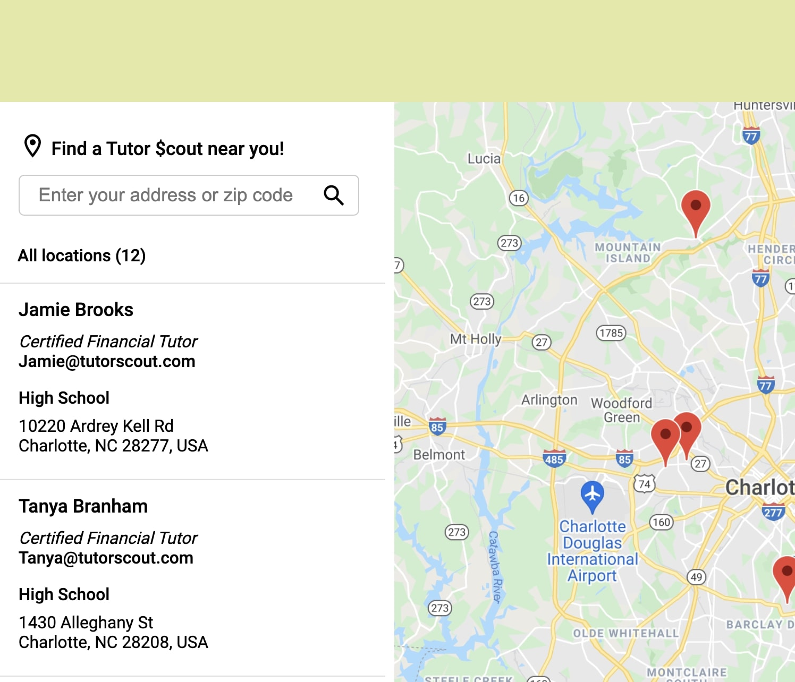

# HopeHacks
<!-- ABOUT THE PROJECT -->
## About The Project

Tutor Scout is an app that helps youth and young adults find their nearest financial tutor
through the usage of a an external API (google maps geolocator) coupled with a private API and 
a database that lists tutors with nearest highschool location and contact information.

<p align="right">(<a href="#top">back to top</a>)</p>


### Built With

* [Google API](https://developers.google.com/maps/documentation/geolocation/overview?_gl=1*qfzu75*_ga*MTI1MjgyMzgyMS4xNjQ1NDI0MzU0*_ga_NRWSTWS78N*MTY0NTQyNDM1My4xLjEuMTY0NTQyNDM4Mi4w)
* [JavaScript](https://www.javascript.com/)
* [node.js](https://nodejs.dev/)


<p align="right">(<a href="#top">back to top</a>)</p>

# Tutor Scouts Google Maps Geolocation API## About The Project

A simple example on how to find a financial tutor with [Geolocation API](https://developer.mozilla.org/en-US/docs/Web/API/Geolocation/Using_geolocation) and display it on a map with [Google Maps Javascript API](https://developers.google.com/maps/documentation/javascript/). Checkout the demo [here](https://google-maps-geolocation.bitballoon.com/).



### Prerequisites

This is an example of how to list things you need to use the software and how to install them.
* npm
  ```sh
  npm install npm@latest -g
  ```

## Installation

### 1. Clone this repository

First, clone this repository to your local computer:

```bash
git clone git@github.com:IvannaTX/HopeHacks.git
```

### 2. Update the Google Maps API Key

Next, you need to update the Google Maps API Key on the [googleapi.html](https://github.com/IvannaTX/HopeHacks/blob/aaf59a579d63ad9d61ff77d68bed66d504f8a9aa/googleapi.html#L558) file:

```html
<script async defer src="https://maps.googleapis.com/maps/api/js?key=YOUR_API_KEY&callback=init"></script>
```

If you don't have one, you can get it [here](https://developers.google.com/maps/documentation/javascript/get-api-key) for free. Don't forget to restrict the **HTTP referrers (web sites)** under the **Key restriction** section.

### 3. Deploy the app

Now, deploy the app in [Heroku](https://devcenter.heroku.com/articles/git).

## Further Readings

- [Geolocation watchPosition](https://developer.mozilla.org/en-US/docs/Web/API/Geolocation/watchPosition)
- [Google Maps Map class](https://developers.google.com/maps/documentation/javascript/reference/3/#Map)
- [Google Maps Marker class](https://developers.google.com/maps/documentation/javascript/reference/3/#Marker)

## Contributing

Contributions are what make the open source community such an amazing place to learn, inspire, and create. Any contributions you make are **greatly appreciated**.

If you have a suggestion that would make this better, please fork the repo and create a pull request. You can also simply open an issue with the tag "enhancement".
Don't forget to give the project a star! Thanks again!

1. Fork the Project
2. Create your Feature Branch (`git checkout -b feature/AmazingFeature`)
3. Commit your Changes (`git commit -m 'Add some AmazingFeature'`)
4. Push to the Branch (`git push origin feature/AmazingFeature`)
5. Open a Pull Request

<p align="right">(<a href="#top">back to top</a>)</p>

## Contact

Tutor Scout - [@scout_tutor](https://twitter.com/scout_tutor) - hello@tutorscout.com

Project Link: [https://github.com/IvannaTX/HopeHacks.git](https://github.com/IvannaTX/HopeHacks.git)

<p align="right">(<a href="#top">back to top</a>)</p>


## License

MIT © [Tutor Scout]()